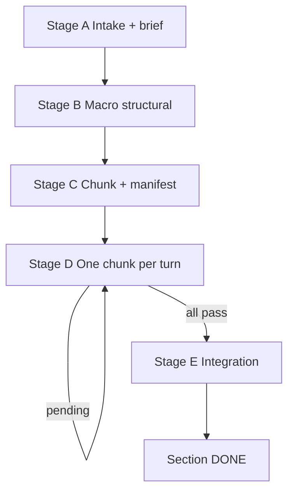

# Physics Paper Editing — Section (macro skill)

Expert section-level editor for physics and mathematics LaTeX. **Orchestrates** the micro skill ([physics-paper-editing](../physics-paper-editing/SKILL.md)); does not replace its Phase 1/Phase 2 pipeline.

## Purpose

Edit a whole `\section{...}` block (or any passage **>12 sentences** the micro skill refuses) by:

1. Fixing **structure** at section scale first (Stage B).
2. Splitting into **≤12-sentence chunks** (Stage C).
3. Running the **micro skill once per chunk** with full verification (Stage D).
4. **Integrating** chunk boundaries (Stage E).

**Non-negotiable:** every shipped prose change passes the micro skill's Phase 2 (`OVERALL: PASS`). The section orchestrator writes **no new prose** — only structure-level moves (reorder, split, signpost). New or changed prose is authored and verified at chunk scope.

## ON RESUME (mandatory)

When resuming any section edit (new chat, "continue", after context compaction):

1. Read `.physics-edit/<slug>/`**session.md`** first.
2. Read `manifest.json` + `section-brief.md`.
3. Honor **job_mode** / **edit_gate** — do **not** re-run micro edit gate Q2.
4. Honor **User special requests** (§ standing + deferred_edits).
5. Honor **Verifier model profile** — no verifier `Task` until `session.md` has `user_confirmed: true`; else AskQuestion first.
6. Execute **Next action** only; rewrite `session.md` before END TURN.

Detail: [disk-layout.md](disk-layout.md) § session.md, [automation.md](automation.md) § Context compaction recovery.

## Terminology

| Term | Meaning |
|------|---------|
| **Stage A–E** | This skill's pipeline (intake → structural → chunk → loop → integrate) |
| **Phase 1 / Phase 2** | Micro skill's in-pipeline verification — runs **inside Stage D** per chunk |
| **Section orchestrator** | This skill's main agent across turns |
| **Chunk agent** | Micro skill main agent (= Producer) for one chunk |

## Agent tiers at section scale

| Tier | Who | Writes prose? | Dispatches? | Grades? |
|------|-----|---------------|-------------|---------|
| **Section orchestrator** | macro main agent | No (structure-only) | Yes — one chunk/turn | No |
| **Chunk agent** | micro skill Producer | Yes | Yes (micro verifiers) | No |
| **Micro verifier / synthesizer Tasks** | per micro rules | No | No | synthesizer only |

**Writer ≠ grader** is preserved: the orchestrator never grades; chunk prose is graded only by the micro synthesizer.

## Pipeline — Stages A–E



| Stage | Detail in |
|-------|-----------|
| A — Intake & section brief | [stages.md](stages.md) § Stage A |
| B — Macro structural pass | [stages.md](stages.md) § Stage B, [scope-and-verifiers.md](scope-and-verifiers.md) |
| C — Chunking & manifest | [stages.md](stages.md) § Stage C, [disk-layout.md](disk-layout.md) |
| D — Chunk loop | [stages.md](stages.md) § Stage D, [chunk-contract.md](chunk-contract.md) |
| E — Integration | [stages.md](stages.md) § Stage E, [scope-and-verifiers.md](scope-and-verifiers.md) |

## Workflow checklist

```
[ ] 0. Confirm scope — whole section or >12 sentences; not a micro-sized quote
[ ] A. Intake — read section + neighbors; job_mode (edit gate Q2); section-brief.md + session.md (**User special requests** + AskQuestion verifier profile)
[ ] B. Macro structural — section-scoped verifiers; apply structure-only fixes; update session.md
[ ] C. Chunk — split ≤12 sentences; manifest.json (edit_gate if mixed); update session.md
[ ] D. Loop — read session.md; pick next pending chunk; invoke micro skill; archive CHECKS; update manifest + session.md; END TURN
[ ]    (repeat D until no pending)
[ ] E. Integration — section-scoped boundary check; route fixes through micro skill; session.md → done
[ ] Done — section summary + all chunks pass + integration PASS
```

**Hard rules:**

- **One chunk per turn** in Stage D — reset context before the next chunk.
- **No nested sub-subagents** — only the micro skill launches verifier Tasks.
- **Disk is memory** — persist `session.md` + `section-brief.md` + `manifest.json`; discard per-chunk verifier reports after PASS.
- **Honor job_mode** — frozen at Stage A; do not re-run edit gate Q2 on resume.
- **Verifier models** — Stage A AskQuestion (*Verifier model profile*); persist in `session.md`; chunk agents inherit only when `user_confirmed: true`. Never auto-select from manifest/brief alone.
- **Boundary fixes** in Stage E go through the micro skill (≤12 sentences each).
- Do not skip Stage B because chunks will be verified later.

## What to Read

| Condition | Read |
|-----------|------|
| **Resuming any turn** | `.physics-edit/<slug>/`**session.md`** first |
| Always | [stages.md](stages.md), [disk-layout.md](disk-layout.md), [chunk-contract.md](chunk-contract.md) |
| Stages B or E | [scope-and-verifiers.md](scope-and-verifiers.md), micro [narrative-checks.md](../physics-paper-editing/narrative-checks.md), [math-checks.md](../physics-paper-editing/math-checks.md) |
| Stage D | micro [SKILL.md](../physics-paper-editing/SKILL.md) (full pipeline per chunk) |
| Resuming a section | `session.md` → `manifest.json` + `section-brief.md` |
| Automation / hooks | [automation.md](automation.md) (optional) |
| Before shipping | [test-checklist.md](test-checklist.md) |

## Response format

### 1. Section summary

- Section role in the paper, central message, notation ledger.
- Current stage and manifest status (e.g. `4/7 chunks pass`).

### 2. Stage report

- **First line — `Mode:`**
  - Stages A–C, E: `Mode: section-edit · stage:<A|B|C|E> · <section-slug>`
  - Stage D (per chunk): copy micro synthesizer `Mode:` **verbatim**, prefixed with `section-edit · chunk:<id> ·`
- Structural findings, manifest updates, chunk summaries.
- **User special requests:** note any new entries in `deferred_edits` (major edits flagged, not shipped).
- Stage E: integration findings.

### 3. Section DONE block (Stage E only)

When all chunks pass and integration PASSes:

```
<!-- SECTION DONE
section: <slug>
chunks: <N> pass
integration: PASS
-->
```

Per-chunk CHECKS live in `.physics-edit/<slug>/chunks/*.checks` — reference paths, do not paste all blocks.

### 4. Next action

- Stage D in progress: **"Continue with next chunk `<id>`"** (context reset).
- Ambiguity: one focused AskQuestion.

## File index

| File | Role |
|------|------|
| [stages.md](stages.md) | Stages A–E step-by-step |
| [disk-layout.md](disk-layout.md) | `.physics-edit/` layout, manifest schema, session.md |
| [chunk-contract.md](chunk-contract.md) | Macro ↔ micro I/O per chunk |
| [scope-and-verifiers.md](scope-and-verifiers.md) | `Scope: section` verifier Tasks (B, E) |
| [automation.md](automation.md) | Context reset, compaction recovery, `/loop`, hook notes |
| [test-checklist.md](test-checklist.md) | End-to-end acceptance checklist |
| [examples/session.example.md](examples/session.example.md) | session.md template (Stage A) |
| [examples/dry-run-manifest.example.json](examples/dry-run-manifest.example.json) | Sample manifest (dry-run) |

## Project-specific context (optional)

When the manuscript is the Ancilla Optimization / QEC error-budgeting paper:

- **Topic:** decomposing logical infidelity into error-mechanism contributions for realistic QEC devices.
- **Typical targets:** `Sections/*.tex`, `Notes/*.tex` standalone notes.
- **Micro skill:** [physics-paper-editing](../physics-paper-editing/SKILL.md) for each chunk.

For other papers, use only the generic workflow above.
