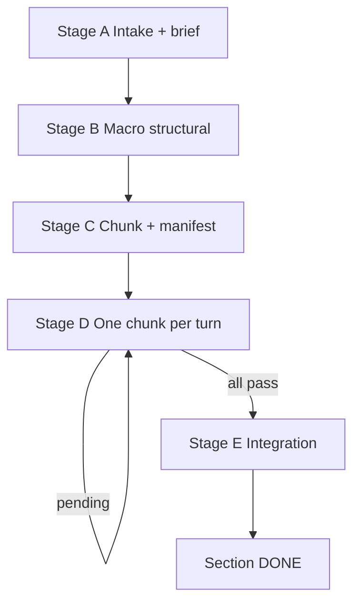

# Physics Paper Editing — Section (macro)

Section-level editor for physics and mathematics LaTeX. **Orchestrates** the standalone micro skill ([physics-paper-editing](../physics-paper-editing/SKILL.md)); does not replace its Phase 1/Phase 2 pipeline.

## Agent read order

| When | Read (in order) |
|------|-----------------|
| **Every resume** | `session.md` → [cross-skill.md](../physics-paper-editing/cross-skill.md) § ON RESUME |
| **Stages A–C, E** | [stages.md](stages.md), [disk-layout.md](disk-layout.md) |
| **Stage B or E** | + [scope-and-verifiers.md](scope-and-verifiers.md) |
| **Stage C or D** | + [chunk-contract.md](chunk-contract.md) |
| **Stage D (per chunk)** | micro [SKILL.md](../physics-paper-editing/SKILL.md) — full steps 1–7 on `chunk_text` only |
| **Automation / hooks** | [automation.md](automation.md) (optional) |
| **Before declaring done** | [test-checklist.md](test-checklist.md) |

| User gives | Use |
|------------|-----|
| ≤12 sentences | **Micro only** — do not start macro |
| >12 sentences or whole `\section{...}` | **This skill** (Stages A–E) |

Shared routing, terminology, verifier handoff: [cross-skill.md](../physics-paper-editing/cross-skill.md).

## Purpose

Edit a whole `\section{...}` block (or any passage **>12 sentences**) by:

1. Fixing **structure** at section scale first (Stage B).
2. Splitting into **≤12-sentence chunks** (Stage C).
3. Running the **micro skill once per chunk** with full verification (Stage D).
4. **Integrating** chunk boundaries (Stage E).

**Non-negotiable:** every shipped prose change passes micro Phase 2 (`OVERALL: PASS`). The section orchestrator writes **no new prose** — only structure-level moves (reorder, split, signpost). Prose is authored and verified at chunk scope only.

## ON RESUME (mandatory)

Follow [cross-skill.md](../physics-paper-editing/cross-skill.md) § ON RESUME. Detail: [disk-layout.md](disk-layout.md) § session.md · [automation.md](automation.md) § Context compaction recovery.

## Terminology

| Term | Meaning |
|------|---------|
| **Stage A–E** | Macro pipeline (intake → structural → chunk → loop → integrate) |
| **Phase 1 / Phase 2** | Micro verification — runs **inside Stage D** per chunk only |
| **Section orchestrator** | Macro main agent — structure only |
| **Chunk agent** | Micro Producer for one chunk — sole author of chunk prose |

Full map: [cross-skill.md](../physics-paper-editing/cross-skill.md) § Terminology map.

## Agent tiers at section scale

| Tier | Who | Writes prose? | Dispatches? | Grades? |
|------|-----|---------------|-------------|---------|
| **Section orchestrator** | macro main agent | No (structure-only) | Yes — one chunk/turn | No |
| **Chunk agent** | micro skill Producer | Yes | Yes (micro verifiers) | No |
| **Micro verifier / synthesizer Tasks** | per micro rules | No | No | synthesizer only |

**Invariants:** [cross-skill.md](../physics-paper-editing/cross-skill.md) § Writer ≠ grader · Orchestrator ≠ self-auditor. User constraints in `session.md` do not waive one-sentence-per-Task rules.

## Pipeline — Stages A–E



| Stage | Goal | Detail |
|-------|------|--------|
| **A** | Intake, brief, verifier profile | [stages.md](stages.md) § Stage A |
| **B** | Structure-only fixes | [stages.md](stages.md) § Stage B · [scope-and-verifiers.md](scope-and-verifiers.md) |
| **C** | Chunk + manifest | [stages.md](stages.md) § Stage C · [disk-layout.md](disk-layout.md) |
| **D** | One chunk per turn (micro Phase 1/2) | [stages.md](stages.md) § Stage D · [chunk-contract.md](chunk-contract.md) |
| **E** | Boundary integration | [stages.md](stages.md) § Stage E · [scope-and-verifiers.md](scope-and-verifiers.md) |

## Workflow checklist

```
[ ] 0. Confirm scope — whole section or >12 sentences; not a micro-sized quote
[ ] A. Intake — read section + neighbors; job_mode (edit gate Q2); section-brief.md + session.md (**User special requests** + AskQuestion verifier profile)
[ ] B. Macro structural — section-scoped verifiers; apply structure-only fixes; update session.md
[ ] C. Chunk — split ≤12 sentences; manifest.json (edit_gate if mixed); update session.md
[ ] D. Loop — read session.md; pick next pending chunk; invoke micro skill; archive CHECKS; update manifest + session.md; END TURN
[ ]    (repeat D until no pending)
[ ] E. Integration — section-scoped boundary check; route fixes through micro skill; session.md → done
[ ] Done — section summary + all chunks pass + integration PASS
```

**Hard rules:**

- **One chunk per turn** in Stage D — reset context before the next chunk.
- **No nested sub-subagents** — only the micro skill launches verifier Tasks.
- **Disk is memory** — persist `session.md` + `section-brief.md` + `manifest.json`; discard per-chunk verifier reports after PASS.
- **Honor job_mode** — frozen at Stage A; do not re-run edit gate Q2 on resume.
- **Verifier models** — Stage A `AskQuestion` once; persist in `session.md` with `user_confirmed: true`. Chunk agents inherit only after confirmation — never from `manifest.json` or `section-brief.md` alone ([cross-skill.md](../physics-paper-editing/cross-skill.md) § Verifier model profile).
- **Boundary fixes** in Stage E go through the micro skill (≤12 sentences each).
- Do not skip Stage B because chunks will be verified later.
- **Stages B/E section verifiers** do not emit CHECKS blocks — record findings in the stage report only ([scope-and-verifiers.md](scope-and-verifiers.md)).

## Response format

### 1. Section summary

- Section role in the paper, central message, notation ledger.
- Current stage and manifest status (e.g. `4/7 chunks pass`).

### 2. Stage report

- **First line — `Mode:`**
  - Stages A–C, E: `Mode: section-edit · stage:<A|B|C|E> · <section-slug>`
  - Stage D (per chunk): copy micro synthesizer `Mode:` **verbatim**, prefixed with `section-edit · chunk:<id> ·`
- Structural findings, manifest updates, chunk summaries.
- **User special requests:** note any new entries in `deferred_edits` (major edits flagged, not shipped).
- Stage E: integration findings.

### 3. Section DONE block (Stage E only)

When all chunks pass and integration PASSes:

```
<!-- SECTION DONE
section: <slug>
chunks: <N> pass
integration: PASS
-->
```

Per-chunk CHECKS live in `.physics-edit/<slug>/chunks/*.checks` — reference paths, do not paste all blocks.

### 4. Next action

- Stage D in progress: **"Continue with next chunk `<id>`"** (context reset).
- Ambiguity: one focused AskQuestion.

## File index

**Macro pipeline**

| File | Role |
|------|------|
| [stages.md](stages.md) | Stages A–E step-by-step |
| [disk-layout.md](disk-layout.md) | `.physics-edit/` layout, manifest, session.md |
| [chunk-contract.md](chunk-contract.md) | Stage D macro ↔ micro I/O |
| [scope-and-verifiers.md](scope-and-verifiers.md) | Section-scoped verifier Tasks (B, E) |
| [automation.md](automation.md) | Context reset, compaction recovery, `/loop` |
| [test-checklist.md](test-checklist.md) | End-to-end acceptance |

**Shared with micro**

| File | Role |
|------|------|
| [cross-skill.md](../physics-paper-editing/cross-skill.md) | Routing, terminology, verifier handoff, ON RESUME |
| [physics-paper-editing/SKILL.md](../physics-paper-editing/SKILL.md) | Standalone micro skill (invoked per chunk in Stage D) |

**Examples**

| File | Role |
|------|------|
| [examples/session.example.md](examples/session.example.md) | session.md template |
| [examples/dry-run-manifest.example.json](examples/dry-run-manifest.example.json) | Sample manifest |

## Project-specific context (optional)

When the manuscript is the Ancilla Optimization / QEC error-budgeting paper:

- **Topic:** decomposing logical infidelity into error-mechanism contributions for realistic QEC devices.
- **Typical targets:** `Sections/*.tex`, `Notes/*.tex` standalone notes.
- **Micro skill:** [physics-paper-editing](../physics-paper-editing/SKILL.md) for each chunk.

For other papers, use only the generic workflow above.
