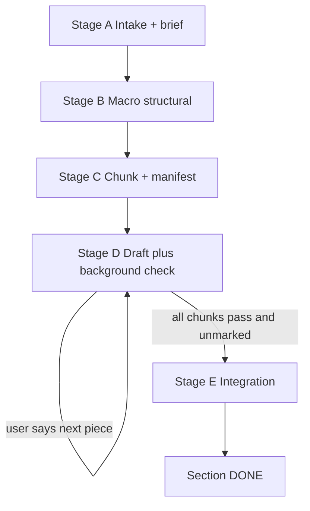

# Physics Paper Editing — Section (macro)

Section-level editor for physics and mathematics LaTeX. **Orchestrates** the standalone micro skill ([physics-paper-editing](../physics-paper-editing/SKILL.md)); does not replace its coworker loop.

**Scope:** passages **>12 sentences** or whole `\section{...}` blocks. For **≤12 sentences**, use the micro skill directly.

## When to use

- Edit a whole `\section{...}` or any passage **>12 sentences** in a physics/math LaTeX manuscript
- Orchestrate chunk-by-chunk drafting with disk state under `.physics-edit/`
- Resume a section edit after context compaction (read `session.md` first)

**Route elsewhere:** **≤12 sentences** → **`physics-paper-editing`** micro skill only — do not start macro Stages A–E.

## Agent read order

| When | Read (in order) |
|------|-----------------|
| **Every resume** | `session.md` → [cross-skill.md](../physics-paper-editing/cross-skill.md) § ON RESUME |
| **Stages A–C, E** | [stages.md](stages.md), [disk-layout.md](disk-layout.md) |
| **Stage B or E** | + [scope-and-verifiers.md](scope-and-verifiers.md) |
| **Stage C or D** | + [chunk-contract.md](chunk-contract.md) |
| **Stage D (per chunk)** | micro [SKILL.md](../physics-paper-editing/SKILL.md) — coworker loop on `chunk_text` only |
| **Every user-facing turn** | [user-communication.md](../physics-paper-editing/user-communication.md) |
| **Automation / hooks** | [automation.md](automation.md) (optional) |
| **Before declaring done** | [test-checklist.md](test-checklist.md) |

| User gives | Use |
|------------|-----|
| ≤12 sentences | **Micro only** — do not start macro |
| >12 sentences or whole `\section{...}` | **This skill** (Stages A–E) |

Shared routing, terminology, verifier handoff: [cross-skill.md](../physics-paper-editing/cross-skill.md).

**First reply:** confirm scope and target/resume state. Ask polish / rewrite / mixed only if unclear. Inherit pace and models when a confirmed profile exists ([user-communication.md](../physics-paper-editing/user-communication.md)).

## Purpose

Edit a whole `\section{...}` (or any passage **>12 sentences**) by:

1. Fixing **structure** at section scale first (Stage B) — may background-verify.
2. Splitting into **≤12-sentence chunks** (Stage C).
3. **Drafting** each chunk into the file with marks and background checks (Stage D). The user may keep editing a marked piece or say **next piece** without waiting for `PASS`.
4. **Integrating** chunk boundaries (Stage E).

The section orchestrator writes **no new body prose** — only structure-level moves (reorder, split, signpost). Prose is authored by the micro coworker loop at chunk scope.

**Non-negotiable:** every chunk job runs background verify. `OVERALL: PASS` unmarks a chunk; it is **not** required before the next piece may be drafted.

## ON RESUME (mandatory)

Follow [cross-skill.md](../physics-paper-editing/cross-skill.md) § ON RESUME. Detail: [disk-layout.md](disk-layout.md) § session.md · [automation.md](automation.md) § Context compaction recovery.

On resume: if any job is `checking`, run the micro wake protocol (related hashes → interrupt → harvest → merge) **before** starting a new piece.

## Terminology

| Term | Meaning |
|------|---------|
| **Stage A–E** | Section pipeline (intake → structural → chunk → draft+check → integrate) |
| **Fast / full** | Background-check scope per chunk — never whether the user waits |
| **Coworker loop** | Micro draft → mark → snapshot → background verify → merge |
| **Section orchestrator** | Macro main agent — structure only |
| **Chunk agent** | Micro producer for one chunk — sole author of that chunk’s prose |

Full map: [cross-skill.md](../physics-paper-editing/cross-skill.md) § Terminology map.

## Agent tiers at section scale

| Tier | Who | Writes prose? | Dispatches? | Grades? |
|------|-----|---------------|-------------|---------|
| **Section orchestrator** | macro main agent | No (structure-only) | Yes — may start another piece while one is checking | No |
| **Chunk agent** | micro skill producer | Yes | Yes (micro verifiers) | No |
| **Micro verifier / synthesizer** | per micro rules | No | No | synthesizer only |

**Invariants:** [cross-skill.md](../physics-paper-editing/cross-skill.md) § Writer ≠ grader · Orchestrator ≠ self-auditor. One **job** per marked region. Do not nest verifier fan-out inside another verifier.

## Pipeline — Stages A–E


```mermaid
flowchart TD
  A[Stage A Intake + brief] --> B[Stage B Macro structural]
  B --> C[Stage C Chunk + manifest]
  C --> D[Stage D Draft plus background check]
  D -->|user says next piece| D
  D -->|all chunks pass and unmarked| E[Stage E Integration]
  E --> done[Section DONE]
```

| Stage | Goal | Detail |
|-------|------|--------|
| **A** | Intake, brief, verifier profile | [stages.md](stages.md) § Stage A |
| **B** | Structure-only fixes | [stages.md](stages.md) § Stage B · [scope-and-verifiers.md](scope-and-verifiers.md) |
| **C** | Chunk + manifest | [stages.md](stages.md) § Stage C · [disk-layout.md](disk-layout.md) |
| **D** | Draft + mark + background job per chunk | [stages.md](stages.md) § Stage D · [chunk-contract.md](chunk-contract.md) |
| **E** | Boundary integration | [stages.md](stages.md) § Stage E · [scope-and-verifiers.md](scope-and-verifiers.md) |

## Workflow checklist

```
[ ] 0. Confirm scope — whole section or >12 sentences; not a micro-sized quote
[ ] A. Intake — read section + neighbors; persist job_mode, pace, models
[ ] B. Macro structural — section-scoped verifiers (may be background); structure-only .tex; update session.md
[ ] C. Chunk — split ≤12 sentences; manifest.json; update session.md
[ ] D. Draft a pending chunk via micro coworker loop; mark it; start its job; end turn
[ ]    User may edit that piece or say next piece (second mark / second job)
[ ] E. When all chunks pass (unmarked, no open conflicts) — boundary check; route fixes through micro
[ ] Done — section receipt + integration PASS
```

**Hard rules:**

- **No nested sub-subagents** — only the micro skill launches verifier Tasks.
- **Disk is memory** — persist `session.md` + `section-brief.md` + `manifest.json` + `jobs/<id>/`.
- Honor `job_mode` and `pace` — frozen at Stage A; do not re-ask on resume.
- **Verifier models** — inherit when `user_confirmed: true`; else defaults + mention once.
- **Boundary fixes** in Stage E go through the micro coworker loop (≤12 sentences each).
- Do not skip Stage B because chunks will be checked later.
- Stages B/E section verifiers do not emit CHECKS in the narrative — record findings in `findings-ledger.md` ([scope-and-verifiers.md](scope-and-verifiers.md)).
- User-facing copy: [user-communication.md](../physics-paper-editing/user-communication.md). Do not say “reply continue.”

## Response format

Follow [user-communication.md](../physics-paper-editing/user-communication.md).

Audit drawer:

- Stages A–C, E: `Mode: section-edit · stage:<A|B|C|E> · <slug>`
- Stage D: `Mode: section-edit · chunk:<id> · verify:<running|partial|complete> · …`

Section DONE (Stage E only, audit drawer):

```
<!-- SECTION DONE
section: <slug>
chunks: <N> pass
integration: PASS
-->
```

Per-chunk CHECKS live in `.physics-edit/<slug>/chunks/*.checks` and `jobs/<id>/` — reference paths, do not paste all blocks.

## Project-specific context (optional)

When the manuscript is the Ancilla Optimization / QEC error-budgeting paper:

- **Topic:** decomposing logical infidelity into error-mechanism contributions for realistic QEC devices.
- **Typical targets:** `Sections/*.tex`, `Notes/*.tex` standalone notes.
- **Micro skill:** [physics-paper-editing](../physics-paper-editing/SKILL.md) for each chunk.

For other papers, use only the generic workflow above.

## File map

**Macro pipeline**

| File | Role |
|------|------|
| [stages.md](stages.md) | Stages A–E step-by-step |
| [disk-layout.md](disk-layout.md) | `.physics-edit/` layout, manifest, jobs, session.md |
| [chunk-contract.md](chunk-contract.md) | Stage D macro ↔ micro I/O |
| [scope-and-verifiers.md](scope-and-verifiers.md) | Section-scoped verifier Tasks (B, E) |
| [automation.md](automation.md) | Resume, compaction recovery, optional watcher |
| [test-checklist.md](test-checklist.md) | End-to-end acceptance |

**Shared with micro**

| File | Role |
|------|------|
| [cross-skill.md](../physics-paper-editing/cross-skill.md) | Routing, terminology, verifier handoff, ON RESUME |
| [coworker-loop.md](../physics-paper-editing/coworker-loop.md) | Draft-first loop |
| [user-communication.md](../physics-paper-editing/user-communication.md) | Workbench UX |

## Related skills

| Skill | When |
|-------|------|
| **physics-paper-editing** | Micro skill — invoked per chunk in Stage D |

## Out of scope

- Passages **≤12 sentences** — micro skill only; do not start macro Stages A–E
- Section orchestrator writing chunk body prose (structure-only moves in Stages B/C/E)
- Skipping Stage B because chunks will be checked later
- Nested sub-subagents beyond the micro skill's verifier Tasks
- Waiting for chunk `PASS` before the user may start the next piece
